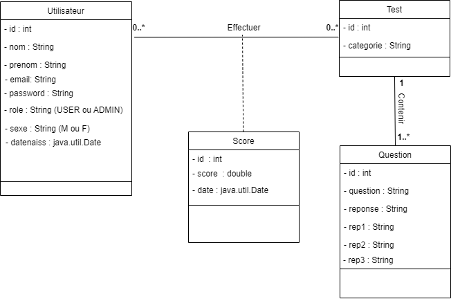
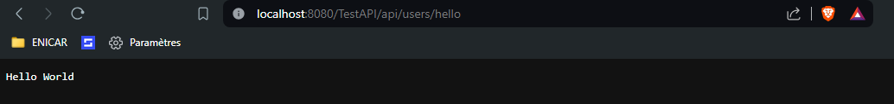
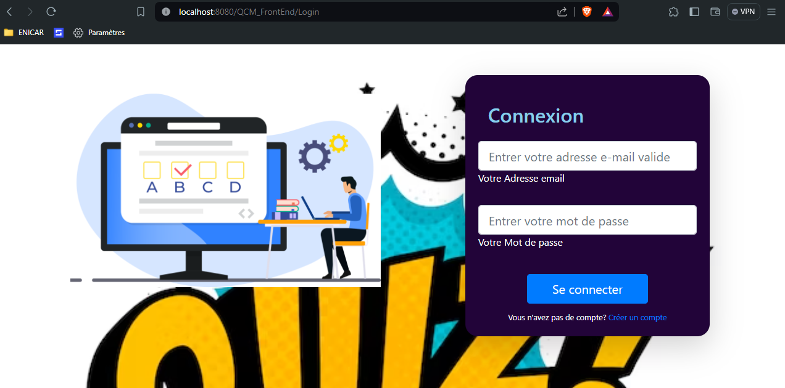

# MINI PROJET JAVA JEE
Ce projet est réalisé dans le cadre du cours JAVA  Entreprise Edition, à POLYTECH ANGERS pour combiner et enrichir les techiniques apprises lors des travaux pratiques. Ceci est donc développé par TORIEN et AMARA Zeineb au cours de l'année scolaire 2023/2024.

# Description 
## Les Entités
Ce projet vise à créer un site pour faire un QUIZ. Pour cela nous avons utilisé 4 entités :
- "Utilisateur" qui peut être un client simple (USER) ou un administrateur 
- Un "Test" qui est caractérisé par une catégorie, et qui comprend plusieurs questions
- Une "Question" composée par une question et 4 réponses dont une seule réponse est vraie
- Un "Score" qui conclut la note des QCM effectué avec un score spécifique selon un "Test" à une date donnée

## Diagramme de classe

## Déroulement de QCM
Lors de test , 10 questions au hasard sont choisies dans la base de données (MySQL) , et les quatre réponses sont affichées dans l'odre aléatoire sur l'écran de l'utilisateur

# Developpement
Pour réaliser ceci nous avons créé deux projets, utilisé un serveur Tomcat v9.0.88 
## API REST (TestAPI)
Pour l'API , nous avons structuré le projet en entities , dao, services. Pour résoudre les problèmes de dépendances, nous avons créé un projet (Web Dynamic Project) puis nous l'avons transformé en projet MAVEN (clic droit -> configure -> Convert To Maven Project). Ensuite, nous avons créé un dossier "classes" dans lequel nous avons mis le fichier persistence.xml. Nous avons donc utilisé ces mots-clés suivants : JDBC, JPA, JPQL, DAO, requêtes précompilées et JAX-RS, JAXB, API REST.
- Utilisation de JPA avec Hibernate pour la persistance de données.

## FRONT END (QCM_FrontEnd)
Nous avons créé un projet Web Dynamic , et nous avons ajouté les fichiers pour gérer les JSON, mapper JSON aux models que nous avons en utilisant Jackson (dans le dossier Ressources de ce répertoire).

### Structures des projets
Nous avons créé quatre packages :
#### Models
Pour reprendre les entités dans l'API (Test, Utilisateur,Qeustion et Score)
#### Services 
qui comprennent les différentes méthodes (CRUD et plus) pour faire à appel à l'API REST
#### Servlets
Qui recoivent les requêtes via le navigateur et traite ces requêtes et renvoie ensuite des pages JSP traitées 
#### Filters 
Qui restreignent l'accès à certaines pages de l'application en fonction de la session de l'utilisateur

# INSTALLATION
## Téléchargement
Télécharger ce projet via la commande `git clone https://github.com/Torien-TORIEN/MiniProjet_Jakarta_EE`
## Serveur Tomcat 
Assurez-vous d'avoir installé le serveur Tomcat v9. Si vous n'avez pas encore installé Tomcat, consultez les instructions ici [comment installer un serveur Tomcat](https://github.com/Torien-TORIEN/JAVA_JEE/tree/main/TP1_Intro)
NB : Toutes les ressources utilisées dans ce projet sont dans le dossier `Ressources`
## Base de données
Mettre en place votre base de données MySQL:
Lancer XAMP ou WAMP ou ...
Créer la base de données `jeeqcmdb` en utilisant le script dans le dossier Database (jeeqcmdb.sql)

## Ouvrir le projet TestAPI
Ouvrir dans Eclipse ou votre IDE préféré testAPI et suivre ces instructions : `clic droit -> Maven -> Update Project` cocher ensuite `Force Update of Snapshots/Realeases` puis `OK`

## Lancer le projet 
`clic droit -> Run -> Run on Server` et choisir ton serveur Tomcat V9

## Tester l'API
Copier dans votre navigateur `http://localhost:8080/TestAPI/api/users/hello`  vous devez voir Hello Word dans votre navigateur 

## Ouvir le projet QCM_FrontEnd
Ouvrir dans votre éditeur préféré le projet FrontEnd , s'il y a un problème de build path faire :
`clic droit -> Build Path ->configure Build Path` puis ajouter dans classpath les jars dans le dossier lib

## Lancer ensuite le projet
`clic droit -> Run -> Run on server `

Normalement si tout se passe bien les deux projets sont lancés dans le serveur tomcat vous devriez voir cette page de login 

